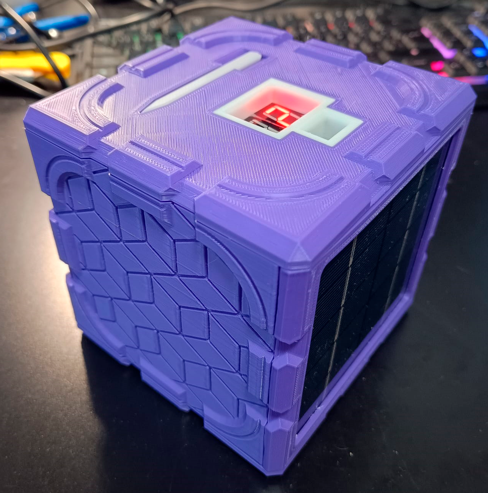
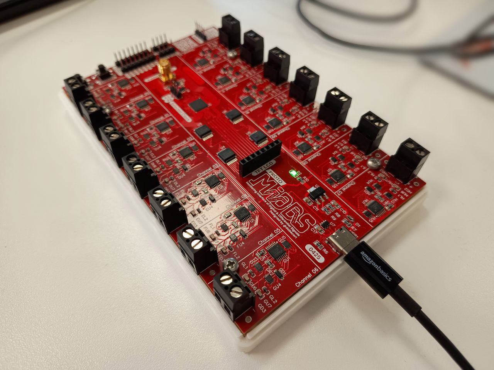
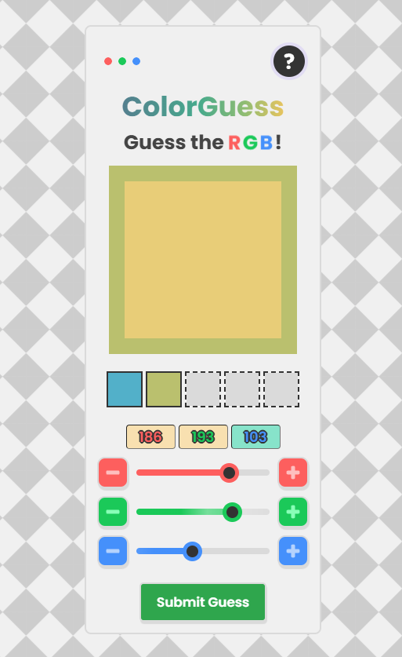

# 💫 Hi! I'm @dabecart!
⚡ I'm a software and electronics everyday engineer.  🎉 The work I post here is what I enjoy doing! 🔭 Currently working on GMV. 🌱 I’m currently learning about compilers and assembly! 

# ⚙️ Projects

|Check out some of my projects!||
|---|---|
|🎲 [The Avalanche Roll](https://github.com/dabecart/TheAvalancheRoll) It's a space-graded truly-random and up to D32 electronic dice that operates on a quantum operated phenomenon called avalanche effect!||
|💻 [MIDDS](https://github.com/dabecart/MIDDS) The MIDDS is a peripheral board designed to connect to a computer via USB, enhancing your software with timestamped GPIO capabilities.||
|🔴🟢🔵 [ColorGuess](https://colorguess.io/) A game where you have to guess the daily color!||

## 🌐 Socials:
 
 

# 💻 Tech Stack:
     

    
# 📊 GitHub Stats:
 

